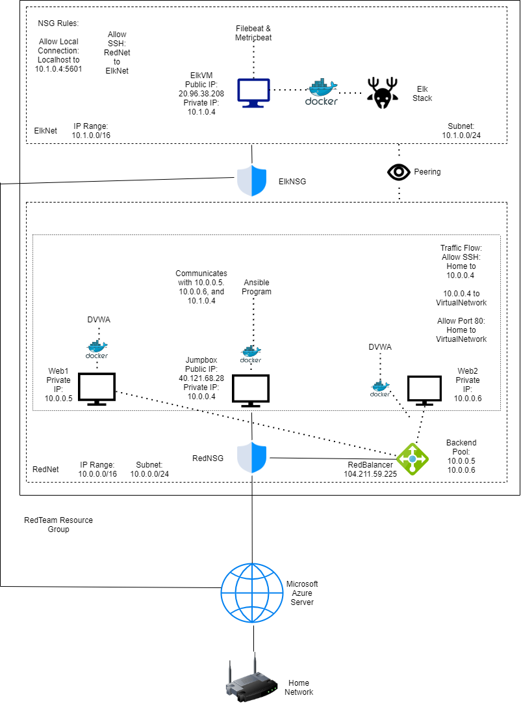
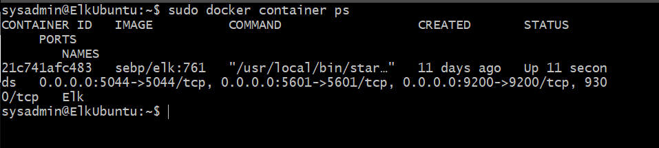

## Automated ELK Stack Deployment

The files in this repository were used to configure the network depicted below.

These files have been tested and used to generate a live ELK deployment on Azure. They can be used to either recreate the entire deployment pictured above. Alternatively, select portions of the .yml file may be used to install only certain pieces of it, such as Filebeat.
  
  - filebeat-playbook.yml
  - metricbeat-install.yml
  - intall-elk.yml

This document contains the following details:
- Description of the Topology
- Access Policies
- ELK Configuration
  - Beats in Use
  - Machines Being Monitored
- How to Use the Ansible Build

### Description of the Topology

The main purpose of this network is to expose a load-balanced and monitored instance of DVWA, the D*mn Vulnerable Web Application.

Load balancing ensures that the application will be secured, in addition to restricting traffic load to the network.
- Load Balancers provide another layer that must be bypassed to access the devices associated with it, adding some more security to the network as a whole.

- "Jump Boxes" are typically heavily secured and monitored environments used to access other devices on the network in a protected manner. Through the Jumpbox_provisioner machine, every other node in the network may be accessed.

Integrating an ELK server allows users to easily monitor the vulnerable VMs for changes to the logs and system metrics.
- Filebeat allows for automated system log organization, maintenance, and forwarding.
- Metricbeat keeps track of and compiles information regarding the metrics of a server's various system services.

The configuration details of each machine may be found below.
_Note: Use the [Markdown Table Generator](http://www.tablesgenerator.com/markdown_tables) to add/remove values from the table_.

| Name     | Function | IP Address | Operating System |
|----------|----------|------------|------------------|
| Jump Box | Gateway  | 10.0.0.1, Pub: 40.121.68.28   | Linux            |
| Web1     | DVWA     | 10.0.0.5   | Linux            |
| Web2     | DVWA     | 10.0.0.6   | Linux            |
| ElkUbuntu| Elk Stack| 10.1.0.4, Pub: 20.96.38.208   | Linux            |

### Access Policies

The machines on the internal network are not exposed to the public Internet. 

Only the Elk machine can accept connections from the Internet. Access to this machine is only allowed from the following IP addresses:
- 10.0.0.4, 10.0.0.5, 10.0.0.6,

Machines within the network can only be accessed by the jumpbox.
- 10.0.0.4

A summary of the access policies in place can be found in the table below.

| Name     | Publicly Accessible | Allowed IP Addresses |
|----------|---------------------|----------------------|
| Jump Box | Yes                 |localhost, 10.0.0.5, 10.0.0.6   |
| Web1/Web2| No                  | 10.0.0.4, 10.0.0.6   |
| Elk      | Yes                 | 10.0.0.4, 10.0.0.5, 10.0.0.6|

### Elk Configuration

Ansible was used to automate configuration of the ELK machine. No configuration was performed manually, which is advantageous because...
- If your network includesa plethora of different devices, ansible allows installations/uninstallations across every device via one playbook file so long as you have the devices' IP addresses.

The playbook implements the following tasks:
- Installs Docker
- Installs pip3, a python3 package installer
- Installs a docker module for python3
- Grabs and launches an ELK image for docker
- Enables docker.io to be enabled on startip

The following screenshot displays the result of running `docker ps` after successfully configuring the ELK instance.

### Target Machines & Beats
This ELK server is configured to monitor the following machines:
- 10.0.0.5
- 10.0.0.6

We have installed the following Beats on these machines:
- Filebeat
- Metricbeat

These Beats allow us to collect the following information from each machine:
- Filebeat collects system logs from the server's services such as Apache logs.
- Metricbeat collects the metrics of these services within the server. You could expect to see metrics of the docker.io service, for example.

### Using the Playbook
In order to use the playbook, you will need to have an Ansible control node already configured. Assuming you have such a control node provisioned: 

SSH into the control node and follow the steps below:
- Copy the install-elk.yml file to /etc/ansible.
- Update the ansible.cfg file to include the IPs of the machine you would like to install the ELK stack onto: in this case, the ElkUbuntu machine.
- Run the playbook, and navigate to 20.96.38.208 to check that the installation worked as expected.

_As a **Bonus**, provide the specific commands the user will need to run to download the playbook, update the files, etc._